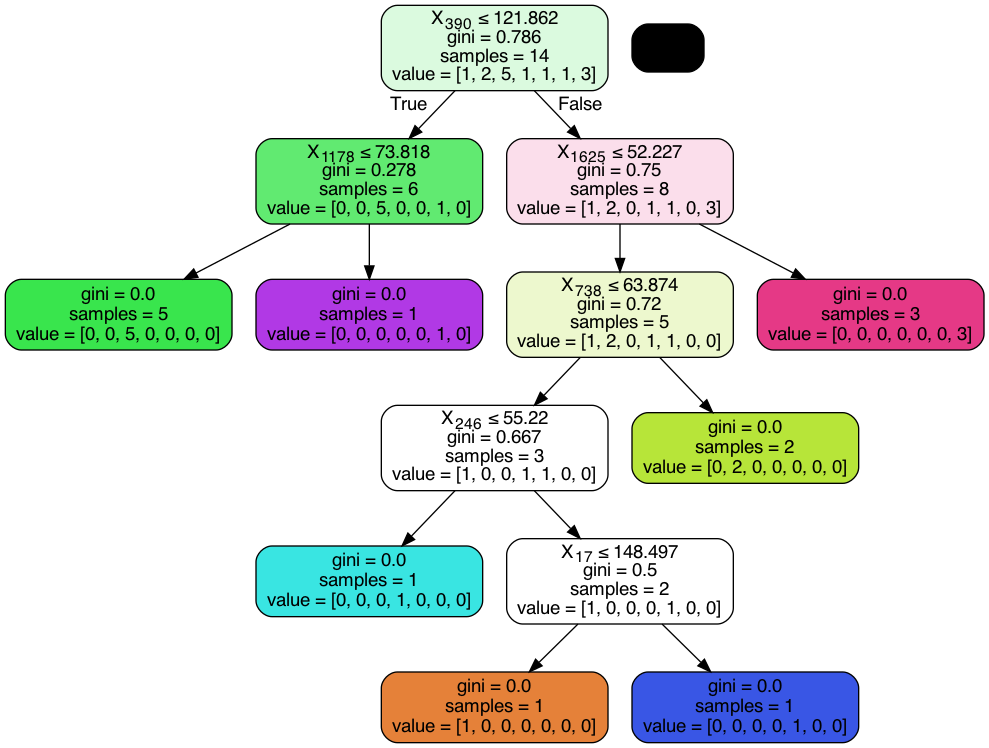

# Datamadness

## Classification
The aim of the classification part was to investigate if its possible to predict the constructor championship 
result based on qualifying results only. This question is interesting because some fans argue that wins are 
only because of the best raw car performance, but is this actually the case? Or are there other factors at play? 
The car qualifying result is an interesting indicator of raw car performance as most of the time there is no 
strategy/pit stops/external factors involved so most of the time the fastest car in qualifying is usually actually the 
best car in terms of raw performance.

`classification_data_prep.ipynb` contains the code that was used to prepare the feature file for this task. 
The rows are organized per year, the class label is the `constructorId` of the constructor that won the 
championship, the features of each class are the qualifying times of 0, 1, or 2 cars (depending on how many finished and availability of data)
of each team for each circuit so for a year Y, there are generally `(number of teams) * (number of cars) * (number of races)`
and the features are different year on year depending on which teams were present and which circuit was raced at.

Two algorithms were used, a normal decision tree classifier and AdaBoost, Adaboost achieved better results
Accuracy on training data =  1.0
Accuracy on test data =  0.8333333333333334

