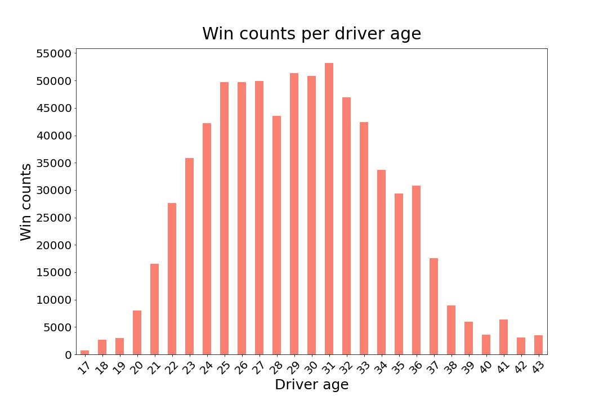

# datamadness

## Importer

## Visualization
In the `Data madness visualization.ipynb notebook`, you will find an exploration of the development of the F1 sport over the years and/or across different circuits.
(i.e., the heatmap distribution of the time pitstops happen in the race, how number of pitstops changes over the year)

The relationship between variables such as driver age, win counts, qualifying position, finishing position. 

It seems that drivers have certain prime time in their carreer.

Moreover, qualifying seems to be a good predictor of the race outcome:

The `heatmaps.zip` file contains the evolution of the reasons for (not) finishing a race from 1950 to 2021.
